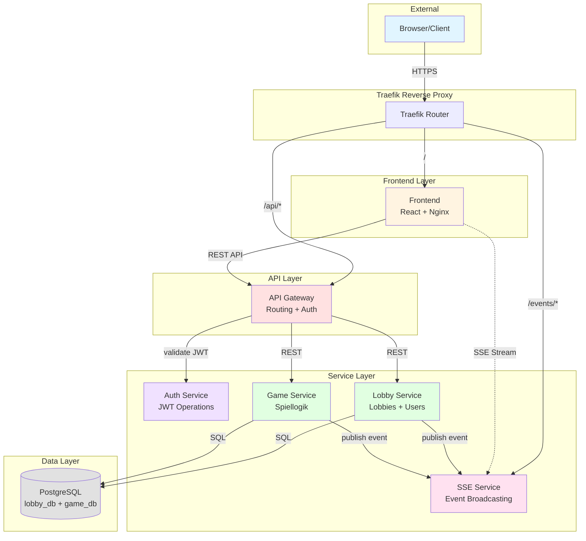

# Microservices-Architektur: Knuffel
## Multiplayer Kniffel Web-Anwendung

**Version:** 1.0  
**Datum:** 23.10.2025  
**Status:** ✅ Finalisiert

---

## Service-Übersicht

| Service | Verantwortlichkeit | Technologie | Datenhaltung |
|---------|-------------------|-------------|--------------|
| **Frontend** | React UI, SSE-Client, REST-Client | React + Nginx/Apache | - |
| **API Gateway** | Routing, zentrale JWT-Validierung | Go | - |
| **Auth Service** | JWT erstellen/validieren | Go | - (stateless) |
| **Lobby Service** | Lobbies, Users, Join-Codes | Go | PostgreSQL (lobby_db) |
| **Game Service** | Spiellogik, Würfeln, Punkte | Go | PostgreSQL (game_db) |
| **SSE Service** | Event-Broadcasting zentral | Go | In-Memory (Connections) |

---

## 2. System-Architektur-Diagramm

### 2.1 Komponenten & Kommunikation



### 2.2 Subdomain-Routing

```
┌─────────────────────────────────────────────────────────────┐
│                    Traefik Reverse Proxy                     │
│                     (Port 80/443, SSL)                       │
└───────────────────┬───────────────────┬────────────────────┘
                    │                   │
    ┌───────────────┼───────────────────┼───────────────┐
    │               │                   │               │
    ▼               ▼                   ▼               ▼
┌─────────┐  ┌──────────┐       ┌──────────┐   ┌──────────┐
│Frontend │  │   API    │       │   SSE    │   │  Others  │
│ (Nginx) │  │ Gateway  │       │ Service  │   │ (Future) │
└─────────┘  └──────────┘       └──────────┘   └──────────┘
     │             │                   │
     │             │                   │
knuffel.      api.knuffel.        events.knuffel.
uni.de           uni.de               uni.de
```

**Routing-Regeln:**
- `https://knuffel.uni.de` → Frontend (Nginx)
- `https://api.knuffel.uni.de/*` → API Gateway
- `https://events.knuffel.uni.de/lobby/:id` → SSE Service
- `https://events.knuffel.uni.de/game/:id` → SSE Service

---

## 3. Service-Verantwortlichkeiten

### 3.1 API Gateway

**Hauptaufgaben:**
- ✅ Routing von Client-Requests zu Backend-Services
- ✅ Zentrale JWT-Validierung (via Auth Service)
- ✅ Request-Weiterleitung mit User-Context
- ✅ CORS-Handling

**Technische Details:**
- Sprache: Go
- Keine Datenhaltung (stateless)

**Auth-Flow:**
```
1. Request kommt mit Cookie: jwt=xxx
2. Gateway extrahiert JWT
3. Gateway → Auth Service: POST /internal/validate
4. Auth Service response: {valid: true, user_id: "abc", username: "Alice"}
5. Gateway fügt Header hinzu:
   X-User-ID: abc
   X-Username: Alice
6. Gateway leitet Request weiter zu Service
```

---

### 3.2 Auth Service

**Hauptaufgaben:**
- ✅ JWT erstellen (für Gast-Accounts)
- ✅ JWT validieren (für alle Requests)
- ✅ Token-Refresh (für OIDC, Stretch-Goal)

**Technische Details:**
- Sprache: Go
- Library: `golang-jwt/jwt`
- Keine Datenhaltung (stateless)
- Secret-Key aus Environment-Variable

**Endpoints (intern):**
```
POST /internal/create
  Request:  {"user_id": "abc", "username": "Alice"}
  Response: {"token": "eyJhbG..."}

POST /internal/validate
  Request:  {"token": "eyJhbG..."}
  Response: {"valid": true, "user_id": "abc", "username": "Alice"}
            {"valid": false, "error": "token expired"}
```

**JWT-Claims:**
```json
{
  "sub": "user-id-123",           // Subject (User-ID)
  "name": "Alice",                // Username
  "iat": 1698345600,              // Issued At
  "exp": 1698432000,              // Expiry (24h)
  "iss": "knuffel-auth-service"   // Issuer
}
```

**Stretch-Goal: OIDC-Integration**
- Zusätzlicher Endpoint: `POST /internal/oidc-exchange`
- Google OAuth Token → Knuffel JWT

---

### 3.3 Lobby Service

**Hauptaufgaben:**
- ✅ Lobby-Lifecycle (erstellen, Status, löschen)
- ✅ User-Management (Gast-Accounts)
- ✅ Join-Code-Generierung
- ✅ Spieler-zu-Lobby-Mapping
- ✅ Lobby-Leiter-Verwaltung
- ✅ Spiel-Start initiieren (→ Game Service)
- ✅ Event-Publishing (→ SSE Service)

**Technische Details:**
- Sprache: Go
- Datenbank: PostgreSQL (lobby_db)
- Tabellen: users, lobbies, players

---

### 3.4 Game Service

**Hauptaufgaben:**
- ✅ Spiellogik (Würfeln, Fixieren, Feld-Auswahl)
- ✅ Punkteberechnung (inkl. Bonus, Mehrfach-Kniffel)
- ✅ Spielzustand-Verwaltung (wer ist dran, Würfelwerte)
- ✅ Timeout-Mechanismus (40s, resettet bei Interaktion)
- ✅ Spielende-Erkennung
- ✅ Event-Publishing (→ SSE Service)

**Technische Details:**
- Sprache: Go
- Datenbank: PostgreSQL (game_db)
- Tabellen: games, scores

---

### 3.5 SSE Service

**Hauptaufgaben:**
- ✅ Zentrale Verwaltung aller SSE-Verbindungen
- ✅ Event-Broadcasting zu Clients
- ✅ Connection-Management (Subscribe/Unsubscribe)
- ✅ Event-Routing nach Lobby-ID

**Technische Details:**
- Sprache: Go
- Datenhaltung: In-Memory (Map: lobby_id → []SSE-Connections)
- Keine Datenbank
- Kein Redis (für MVP, Single-Instance)

**Architektur:**
```
┌─────────────────────────────────────────────────┐
│              SSE Service                         │
│                                                  │
│  ┌─────────────────────────────────────────┐   │
│  │  Connection Manager (In-Memory)          │   │
│  │                                          │   │
│  │  Map[lobby_id] → []SSE-Connections       │   │
│  │                                          │   │
│  │  lobby-abc123:                           │   │
│  │    - Connection 1 (User Alice)           │   │
│  │    - Connection 2 (User Bob)             │   │
│  │    - Connection 3 (User Charlie)         │   │
│  └─────────────────────────────────────────┘   │
│                                                  │
│  ┌─────────────────────────────────────────┐   │
│  │  Event Broadcaster                       │   │
│  │  - Receives events from Services         │   │
│  │  - Routes to correct lobby connections   │   │
│  └─────────────────────────────────────────┘   │
└─────────────────────────────────────────────────┘
```

**Connection-Flow:**
```
1. Client öffnet SSE-Verbindung
   GET /events/lobby/abc123
   Cookie: jwt=xxx

2. SSE Service:
   - Validiert JWT
   - Extrahiert User-ID
   - Registriert Connection: lobby_abc123 → [conn1, conn2, ...]

3. Event kommt von Service:
   POST /internal/broadcast {"lobby_id": "abc123", ...}

4. SSE Service:
   - Lookup: lobby_abc123 → [conn1, conn2, conn3]
   - Sendet Event an alle Connections:
     event: player_joined\ndata: {...}\n\n

5. Client schließt Verbindung:
   - SSE Service entfernt Connection aus Map
```

---

### 3.6 Frontend

**Hauptaufgaben:**
- ✅ React-UI für alle Screens
- ✅ REST-API-Client (zu API Gateway)
- ✅ SSE-Client (zu SSE Service)
- ✅ State-Management (React Context/Redux)
- ✅ Routing (React Router)

**Technische Details:**
- Sprache: TypeScript + React
- Styling: Tailwind CSS
- HTTP-Client: Axios (mit Cookie-Support)
- SSE-Client: Native EventSource API
- Build: Vite oder Create-React-App
- Deployment: Nginx oder Apache (Docker)

---

## 4. Service-Kommunikation

### 4.1 Kommunikations-Matrix

| Von ↓ / Zu → | API Gateway | Auth | Lobby | Game | SSE | DB |
|--------------|-------------|------|-------|------|-----|----|
| **Frontend** | REST | - | - | - | SSE | - |
| **API Gateway** | - | REST | REST | REST | - | - |
| **Auth** | - | - | - | - | - | - |
| **Lobby** | - | - | - | REST | REST | SQL |
| **Game** | - | - | - | - | REST | SQL |
| **SSE** | - | - | - | - | - | - |

### 4.2 Protokolle

| Kommunikation | Protokoll | Technologie |
|---------------|-----------|-------------|
| Frontend → API Gateway | REST (HTTPS) | Axios |
| Frontend → SSE Service | SSE (HTTPS) | EventSource |
| API Gateway → Auth | REST (HTTP) | Go http.Client |
| API Gateway → Lobby | REST (HTTP) | Go http.Client |
| API Gateway → Game | REST (HTTP) | Go http.Client |
| Lobby → Game | REST (HTTP) | Go http.Client |
| Lobby → SSE | REST (HTTP) | Go http.Client |
| Game → SSE | REST (HTTP) | Go http.Client |
| Services → PostgreSQL | SQL | `lib/pq` Driver |

### 4.3 Inter-Service-Kommunikation

**Service Discovery:**
- MVP: Statische Config (Docker-Compose Service-Namen)

**Retry-Logik:**
- Exponential Backoff bei Service-Ausfällen
- Circuit-Breaker (optional, Stretch-Goal)

---

## 6. Deployment-Architektur

### 6.2 Netzwerk-Topologie

```
┌────────────────────────────────────────────────────────────┐
│                     Uni Linux Server                        │
│                  (2 Cores, 4GB RAM)                         │
│                                                             │
│  ┌──────────────────────────────────────────────────────┐ │
│  │              Docker Bridge Network                    │ │
│  │                                                       │ │
│  │  ┌─────────┐  ┌─────────┐  ┌─────────┐  ┌────────┐ │ │
│  │  │Frontend │  │ Gateway │  │  Lobby  │  │  Game  │ │ │
│  │  │  :80    │  │  :8080  │  │  :8080  │  │ :8080  │ │ │
│  │  └─────────┘  └─────────┘  └─────────┘  └────────┘ │ │
│  │                                                       │ │
│  │  ┌─────────┐  ┌─────────┐  ┌────────────────────┐  │ │
│  │  │  Auth   │  │   SSE   │  │    PostgreSQL      │  │ │
│  │  │  :8080  │  │  :8080  │  │      :5432         │  │ │
│  │  └─────────┘  └─────────┘  └────────────────────┘  │ │
│  │                                   │                  │ │
│  │                           Volume: postgres_data     │ │
│  └───────────────────────────────────────────────────── │ │
│                                                          │ │
│  ┌──────────────────────────────────────────────────────┐│
│  │                  Traefik (Ports 80/443)              ││
│  │  - SSL Termination                                   ││
│  │  - Subdomain Routing                                 ││
│  │  - Load Balancing (später)                           ││
│  └──────────────────────────────────────────────────────┘│
└────────────────────────────────────────────────────────────┘
                          │
                          │ Internet
                          ▼
                    ┌──────────┐
                    │  Browser │
                    └──────────┘
```

---

## 7. Security & Resilience

### 7.1 Security-Maßnahmen

**JWT-Security:**
- HTTP-Only Cookies (kein JS-Zugriff)
- Secure Flag (nur HTTPS)
- SameSite=Strict (CSRF-Schutz)
- Token-Expiry: 24h
- HMAC-SHA256 Signierung
- Secret aus Environment-Variable (nicht im Code)

**API-Security:**
- CORS-Policy (nur eigene Domains)
- Rate-Limiting im API Gateway (10 req/sec pro User)
- Input-Validierung in jedem Service
- SQL-Prepared-Statements (gegen Injection)

**Network-Security:**
- Interne Services nicht von außen erreichbar
- Nur Traefik exposed (Ports 80/443)
- Service-zu-Service über Docker-Netzwerk (unverschlüsselt, da intern)
- PostgreSQL nicht exposed (nur intern)

**Secrets-Management:**
```bash
# .env (nicht in Git!)
JWT_SECRET=xxx...
DB_PASSWORD=yyy...
```

### 7.2 Error-Handling

**Service-Ausfälle:**
- Retry-Logik mit Exponential Backoff (max 3 Versuche)
- Timeout für Inter-Service-Calls (5 Sekunden)
- Graceful Degradation:
  - SSE-Service down → Frontend zeigt "Live-Updates unavailable"
  - Auth-Service down → Gateway cached alte JWT-Validierungen (5 Min)

**Database-Ausfälle:**
- Connection-Pool mit Retry
