---
header-includes:
  - \usepackage{fvextra}
  - \DefineVerbatimEnvironment{Highlighting}{Verbatim}{breaklines,commandchars=\\\{\}}
---


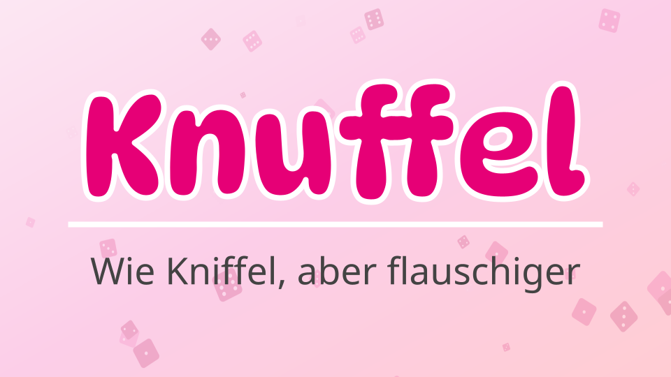

Wir haben ein echtzeitfähiges Multiplayer Online Kniffelspiel entwickelt. 

# Demo

## Startseite

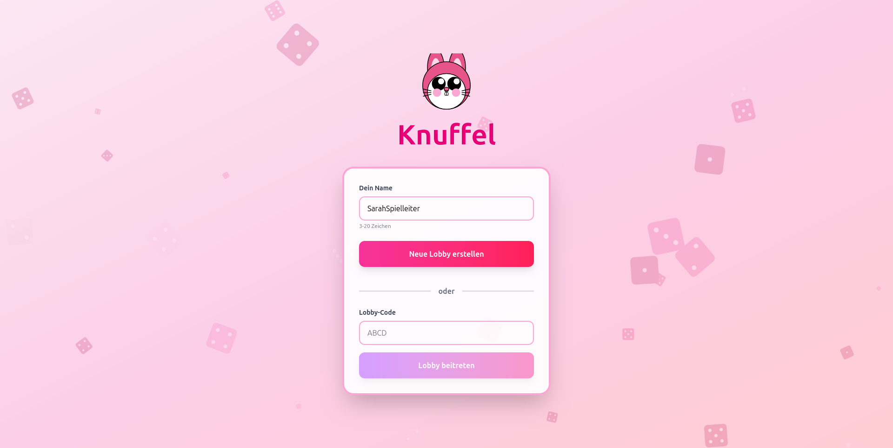

## Lobbyseite

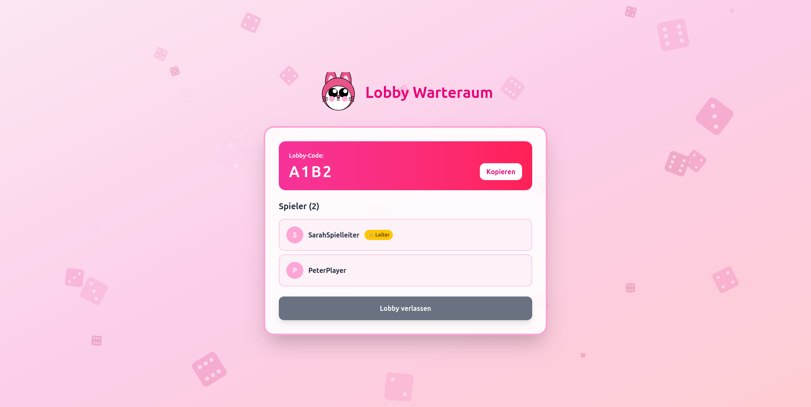

## Spielseite

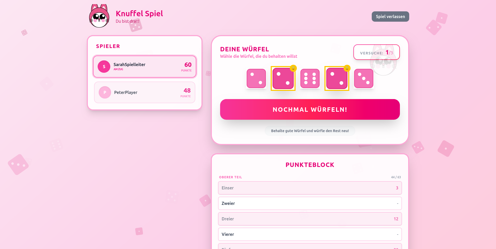

## Ergebnisseite

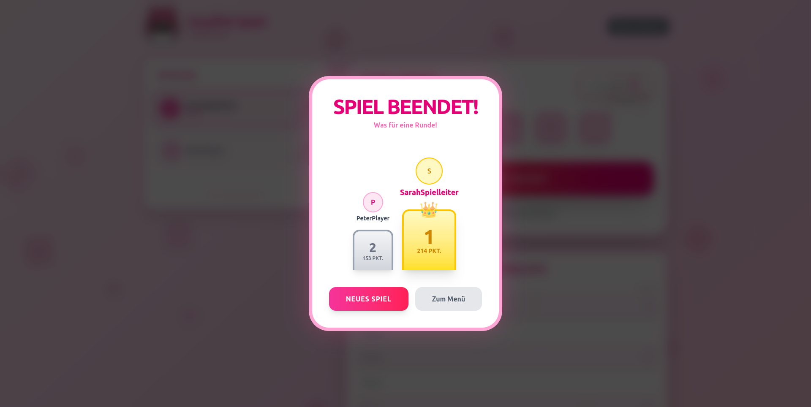

# Systemarchitektur

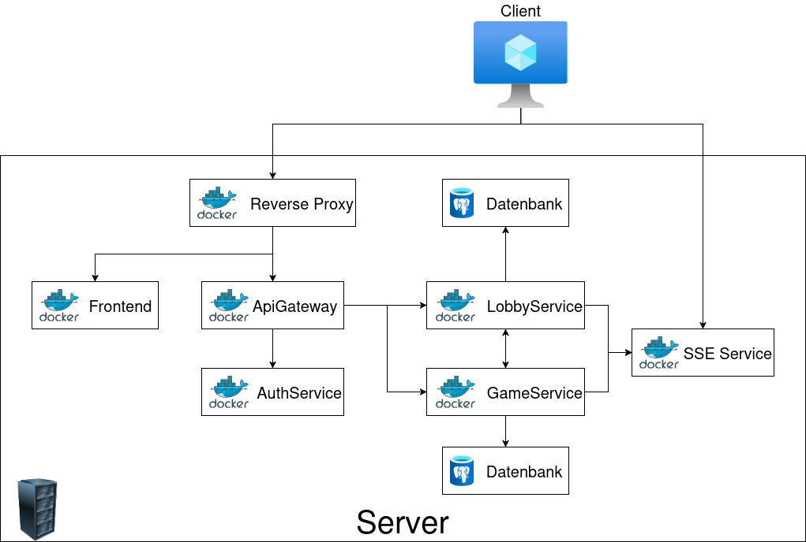

Die Systemarchitektur besteht aus einem Server und unterschiedlichen Diensten, die in Form von Docker-Containern bereitgestellt werden.
Durch die Containerisierung sind alle Dienste isoliert und kommunizieren ausschließlich über das virtuelle Docker-Netzwerk miteinander.

Im Schaubild sind folgende Dienste dargestellt:

- **Reverse Proxy**: Der Reverse Proxy leitet die Anfragen der Clients an den entsprechenden Dienst (Frontend / Backend Services) weiter. Zusätzlich sorgt er für die TLS-Verschlüsselung der Kommunikation. Er erlaubt den Zugriff auf die Dienste über eine einzige öffentliche Domain.

- **Frontend**: Das Frontend ist eine Single Page Application (SPA), die in React entwickelt wurde. Es stellt die Benutzeroberfläche des Kniffelspiels dar und kommuniziert mit den Backend Services über REST-APIs und Server-Sent Events (SSE).

- **Api Gateway**: Das API Gateway fungiert als zentraler Einstiegspunkt für alle Backend-Services. Es leitet die Anfragen der Clients an den entsprechenden Microservice weiter, validiert die JWT-Tokens zur Authorisierung und fügt den User-Header zur Authentifizierung hinzu.

- **Auth Service**: Der Auth Service ist für die Authentifizierung und Autorisierung der Benutzer zuständig. Stellt JWT-Tokens aus und verifiziert diese für das API Gateway.

- **Lobby Service**: Der Lobby Service verwaltet die Spiel-Lobbys, in denen sich die Spieler vor dem Spielstart treffen. Er ermöglicht das Erstellen, Beitreten und Verlassen von Lobbys und hält die Spielerinformationen.

- **Game Service**: Der Game Service ist für die Spiellogik und den Spielablauf verantwortlich. Er verwaltet die Spielzustände, Würfelwürfe und Punktevergabe.

- **SSE Service**: Der SSE Service stellt eine Verbindung zu den Clients her, um Echtzeit-Updates über Server-Sent Events zu senden. Er empfängt Ereignisse von den anderen Diensten und leitet sie an die entsprechenden Clients weiter.

- **Datenbanken**: Lobby und Game Service besitzen jeweils eine eigene Datenbank zur Speicherung der relevanten Daten.

# Userflows

## Flow 1: User-Onboarding & Lobby erstellen

### Szenario
Ein neuer User öffnet die App, gibt einen Username ein und erstellt eine neue Lobby.

### Sequenzdiagramm

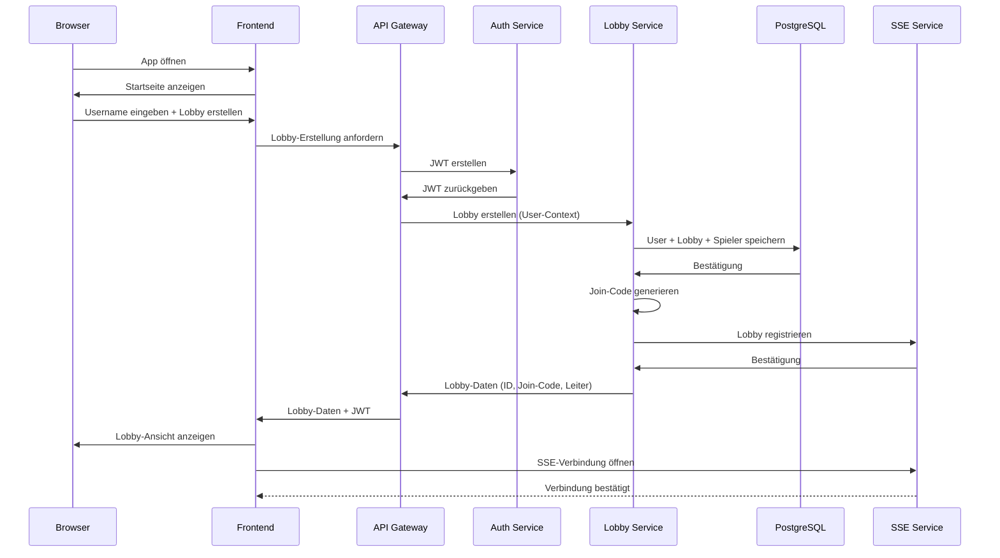

### Wichtige Datenflüsse
- Username → JWT-Erstellung
- Lobby-Daten → Persistierung
- Join-Code-Generierung
- SSE-Verbindung für Live-Updates

---

## Flow 2: Lobby beitreten

### Szenario
Ein zweiter User (Bob) möchte der Lobby von Alice beitreten. Er gibt seinen Username und den Join-Code ein.

### Sequenzdiagramm

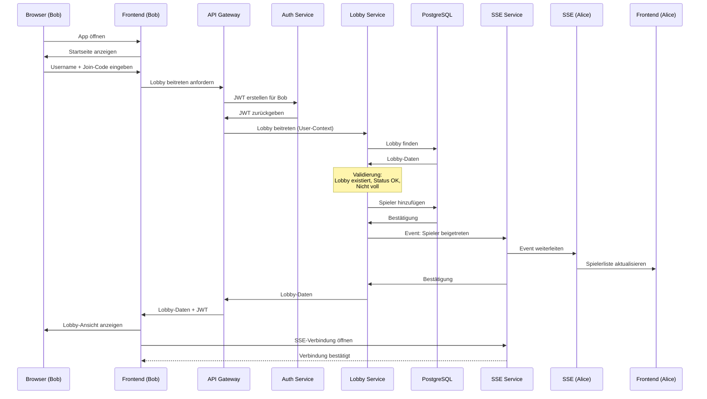

### Wichtige Datenflüsse
- Join-Code → Lobby-Identifikation
- Spieler-Hinzufügen → Persistierung
- Event → Alle Lobby-Mitglieder
- Neue SSE-Verbindung

---

## Flow 3: Spiel starten

### Szenario
Alice (Lobby-Leiter) klickt auf "Spiel starten". Das System erstellt ein Game, legt die Zugreihenfolge fest und leitet alle Spieler zur Spielseite weiter.

### Sequenzdiagramm

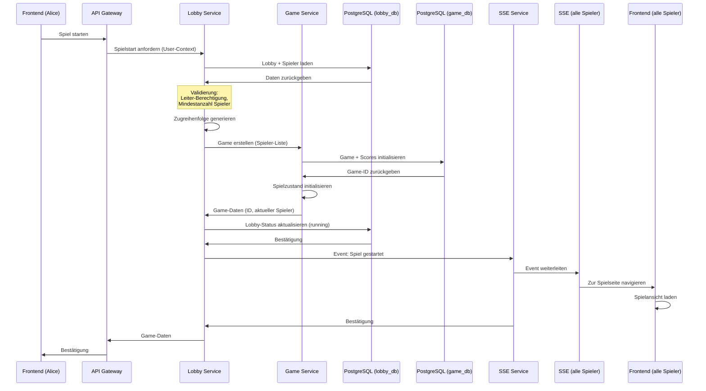

### Wichtige Datenflüsse
- Leiter-Berechtigung → Validierung
- Zufällige Zugreihenfolge → Generierung
- Game-Initialisierung → Persistierung
- Event → Alle Spieler gleichzeitig
- Lobby-Status-Änderung (waiting → running)

---

## Flow 4: Spielzug komplett

### Szenario
Charlie ist am Zug. Er würfelt dreimal, fixiert Würfel zwischen den Würfen, wählt dann ein Feld aus. Danach ist Alice an der Reihe.

### Sequenzdiagramm

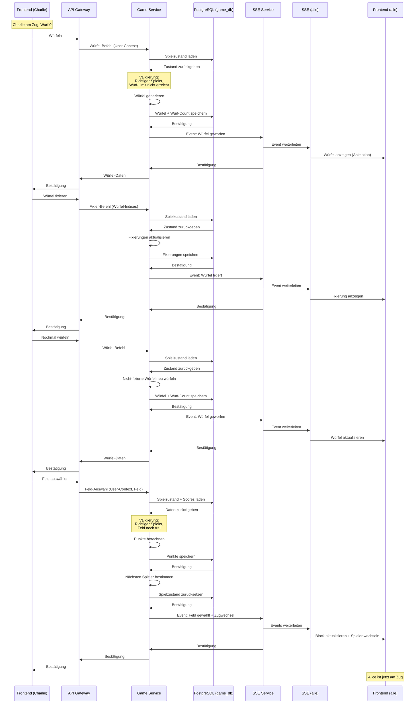

### Wichtige Datenflüsse
- Würfeln: Zufallswerte → Persistierung → Broadcasting
- Fixieren: Würfel-Auswahl → Persistierung → Broadcasting
- Punkteberechnung: Würfel + Feld → Punkte
- Zugwechsel: Spieler-Index → Nächster Spieler
- Timer-Reset bei jeder Interaktion

---

## Flow 5: Spielende erkennen & Rangliste

### Szenario
Alice füllt ihr letztes (13.) Feld aus. Der Game Service erkennt, dass alle Spieler fertig sind, berechnet die Endpunkte und erstellt eine Rangliste.

### Sequenzdiagramm

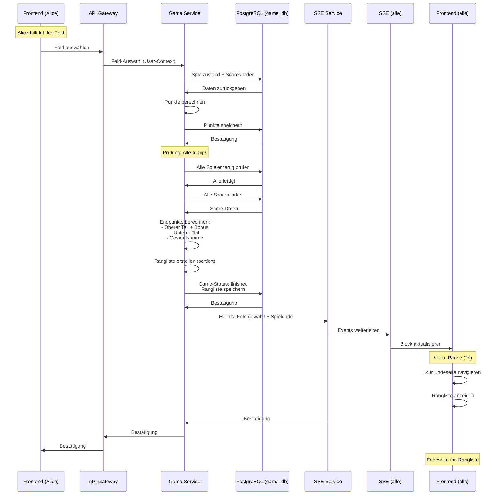

### Wichtige Datenflüsse
- Letzte Feldwahl → Punkteberechnung
- Prüfung: Alle Spieler fertig?
- Endpunkte-Berechnung (Bonus-Logik)
- Rangliste erstellen (sortiert)
- Game-Status: running → finished
- Navigation aller Spieler zur Endeseite

---

## Flow 6: Nochmal spielen / Neue Runde

### Szenario
Die Spieler sind auf der Endeseite. Alice (Lobby-Leiter) klickt auf "Nochmal spielen". Eine neue Lobby wird mit denselben Spielern erstellt.

### Sequenzdiagramm

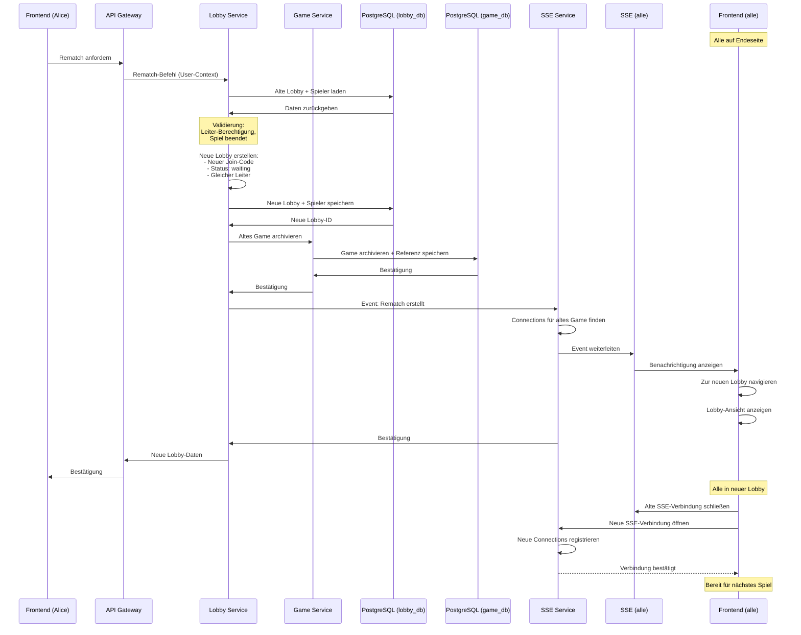

### Wichtige Datenflüsse
- Rematch-Berechtigung → Validierung (nur original Leiter)
- Neue Lobby-Erstellung (neuer Join-Code)
- Spieler-Übernahme (automatisch)
- Altes Game → Archivierung
- Event → Alle Spieler
- SSE-Verbindungen wechseln (alt → neu)

# Architektursichten

## 3-Schichtenarchitektur

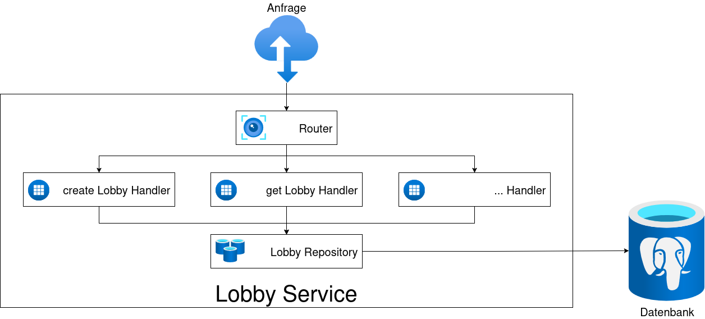

Die Kernservices (Lobby Service und Game Service) sind nach dem 3-Schichtenarchitektur-Muster aufgebaut.

Die Services enthalten einen Router, der die eingehenden HTTP-Anfragen entgegennimmt und an die entsprechenden Handler weiterleitet.
Der Router stellt somit die Präsentationsschicht dar.

Die Handler implementieren die Anwendungslogik.

Die Datenzugriffsschicht wird durch Repositorys und Models realisiert, die den Zugriff auf die Datenbanken kapseln und feste Interfaces definieren.

### Codebeispiel: Router

```{.go .numberLines}
// New constructs the HTTP router with repository and join code generator dependencies
func New(repo repository.Repository, codeGen *joincode.Generator) http.Handler {
	r := chi.NewRouter()
	// replace chi default logger with structured slog based middleware
	l := logger.Default()
	r.Use(logger.ChiMiddleware(l))

	// Healthcheck
	healthcheck.Mount(r)

	// Internal endpoints (no auth required)
	r.Route("/internal", func(r chi.Router) {
		r.Route("/lobbies", func(r chi.Router) {
			r.Put("/{lobby_id}/players/{player_id}/active", handlers.UpdatePlayerActiveStatusHandler(repo))
			r.Get("/{lobby_id}", handlers.GetLobbyInternalHandler(repo))
		})
	})

	// Lobby endpoints grouped under auth middleware
	r.Route("/lobbies", func(r chi.Router) {
		// Authentication middleware (reads X-User-ID / X-Username and injects user into context)
		r.Use(auth.AuthMiddleware)

		// Create lobby (any authenticated user)
		r.Post("/", handlers.CreateLobbyHandler(repo, codeGen))

		// Join lobby (any authenticated user)
		r.Post("/join", handlers.JoinLobbyHandler(repo))

		// Get lobby details - require membership
		r.With(handlers.RequireLobbyMember(repo)).Get("/{lobby_id}", handlers.GetLobbyHandler(repo))

		// Kick player - require leadership
		r.With(handlers.RequireLobbyLeader(repo)).Post("/{lobby_id}/kick", handlers.KickPlayerHandler(repo))

		// Other lobby routes can use RequireLobbyMember or RequireLobbyLeader as appropriate
		// e.g. r.With(handlers.RequireLobbyLeader(repo)).Post("/{lobby_id}/start", handlers.StartLobbyHandler(db))
	})

	return r
}
```

### Codebeispiel: Handler

```{.go .numberLines}
// GetLobbyInternalHandler returns an http.HandlerFunc that retrieves lobby details for internal use
// Path parameter: lobby_id (UUID)
// Returns lobby details with all players, no authentication or authorization required
func GetLobbyInternalHandler(repo repository.Repository) http.HandlerFunc {
	return func(w http.ResponseWriter, r *http.Request) {
		log := logger.Logger(r.Context()).WithGroup("handler").With(slog.String("action", "get_lobby_internal"))

		// Extract lobby_id from URL path parameter
		lobbyIDStr := chi.URLParam(r, "lobby_id")
		if lobbyIDStr == "" {
			log.Warn("missing lobby_id parameter")
			httpx.WriteBadRequest(w, "Missing lobby_id parameter", nil, log)
			return
		}

		lobbyID, err := uuid.Parse(lobbyIDStr)
		if err != nil {
			log.Warn("invalid lobby_id format", slog.String("lobby_id", lobbyIDStr), slog.String("error", err.Error()))
			httpx.WriteBadRequest(w, "Invalid lobby ID format", map[string]interface{}{"detail": err.Error()}, log)
			return
		}

		// Query lobby via repository
		response, err := repo.GetLobbyDetail(r.Context(), lobbyID)
		if err == sql.ErrNoRows {
			log.Info("lobby not found", slog.String("lobby_id", lobbyID.String()))
			httpx.WriteNotFound(w, "Lobby not found", log)
			return
		}
		if err != nil {
			log.Error("failed to query lobby", slog.String("error", err.Error()), slog.String("lobby_id", lobbyID.String()))
			httpx.WriteInternalError(w, "Database error", nil, log)
			return
		}

		log.Info("lobby details retrieved",
			slog.String("lobby_id", lobbyID.String()),
			slog.Int("player_count", len(response.Players)))

		httpx.WriteJSON(w, http.StatusOK, response, log)
	}
}
```

### Codebeispiel: Repository

```{.go .numberLines}
func (r *PostgresRepository) CreateLobbyTx(tx *sql.Tx, joinCode string, leaderID uuid.UUID) (uuid.UUID, error) {
	var lobbyID uuid.UUID
	if err := tx.QueryRow(`
		INSERT INTO lobbies (join_code, leader_id, status)
		VALUES ($1, $2, $3)
		RETURNING id
	`, joinCode, leaderID, models.LobbyStatusWaiting).Scan(&lobbyID); err != nil {
		return uuid.Nil, err
	}
	return lobbyID, nil
}
```

## Model View Presenter (MVP)


Die Anwendung lässt sich auch in das Model-View-Presenter (MVP) Muster einordnen.
- **View**: Das Frontend (React SPA) stellt die View dar. Es ist verantwortlich für die Darstellung der Benutzeroberfläche und die Interaktion mit dem Benutzer.
- **Presenter**: Das API Gateway fungiert als Presenter. Es vermittelt zwischen der View (Frontend) und dem Model (Backend Services). Es verarbeitet die Anfragen der View, ruft die entsprechenden Backend Services auf und formatiert die Antworten für die View.
- **Model**: Die Backend Services repäsentieren das Model. Sie enthalten die Geschäftslogik und den Datenzugriff.

## Standardmodell für Webanwendungen

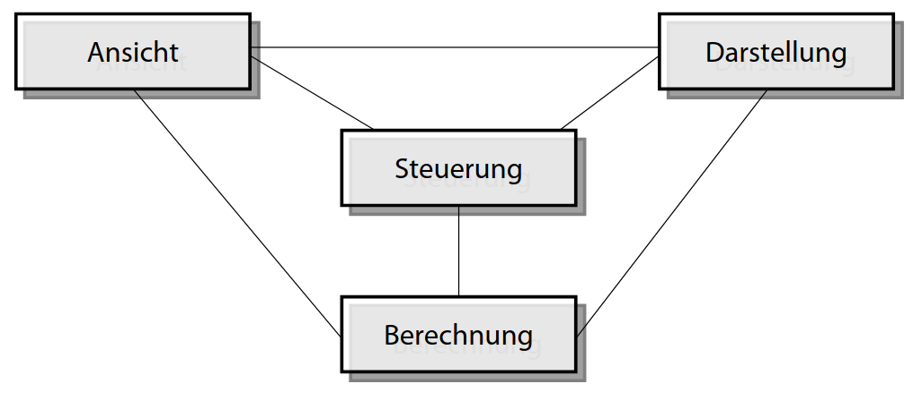

- **Ansicht**: Frontend (React SPA)
- **Darstellung**: API Gateway
- **Steuerung**: Backend Services
- **Berechnung**: Backend Services

## Serviceorientierte Architektur (SOA)

Die Systemarchitektur ist in form von Microservices gestaltet, die jeweils eine spezifische Domäne abdecken (z.B. Lobby Management, Spiel-Logik, Authentifizierung).
Jeder Dienst ist unabhängig deploybar und skalierbar, was eine hohe Flexibilität und Wartbarkeit ermöglicht.
Die Dienste kommunizieren über klar definierte Schnittstellen (REST-APIs, SSE), was die lose Kopplung zwischen den Komponenten fördert.

- **Interaction Services**: Frontend (React SPA), SSE Service – stellen die Schnittstelle zum Benutzer dar und ermöglichen Echtzeitkommunikation
- **Processing Services**: API Gateway, Auth Service, Lobby Service, Game Service – implementieren die Geschäftslogik und verarbeiten Anfragen
- **Information Services**: Lobby Service, Game Service – verwalten und persistieren domänenspezifische Daten (Lobby-Zustände, Spielstände)
- **Access Services**: PostgreSQL Datenbanken, Auth Service (Token-Verwaltung) – kontrollieren den Zugriff auf Datenspeicher und Autorisierung