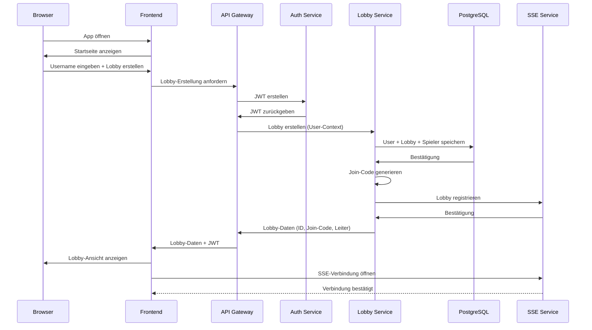
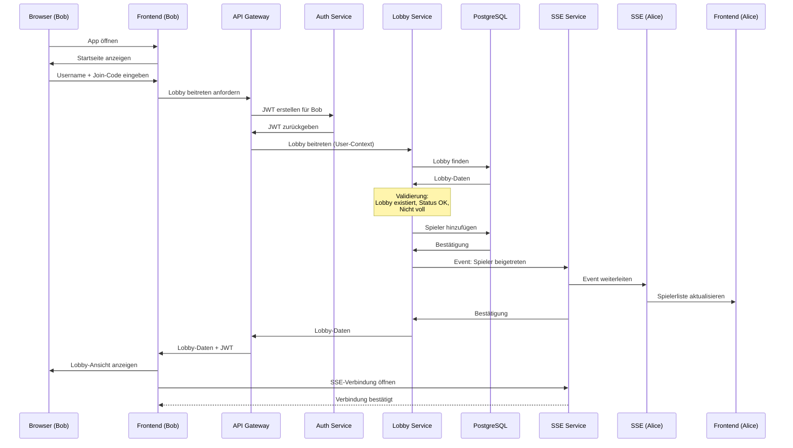
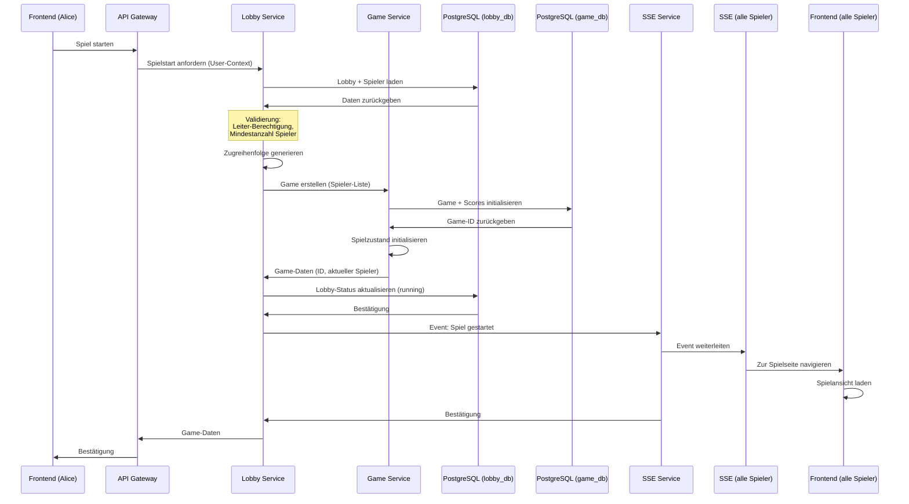
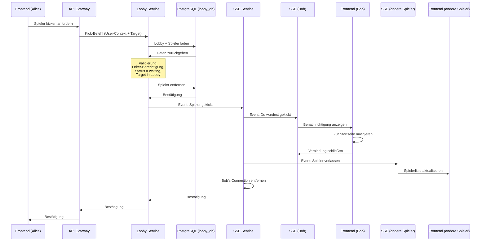
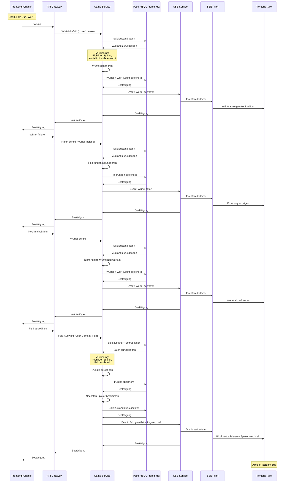
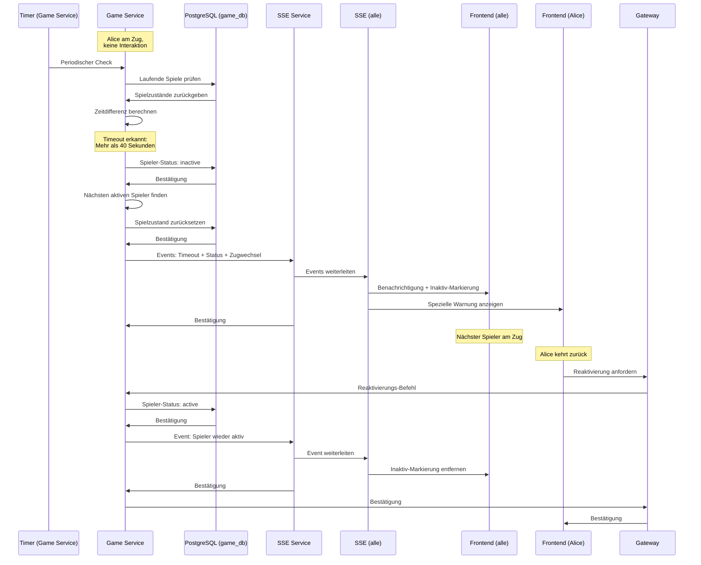
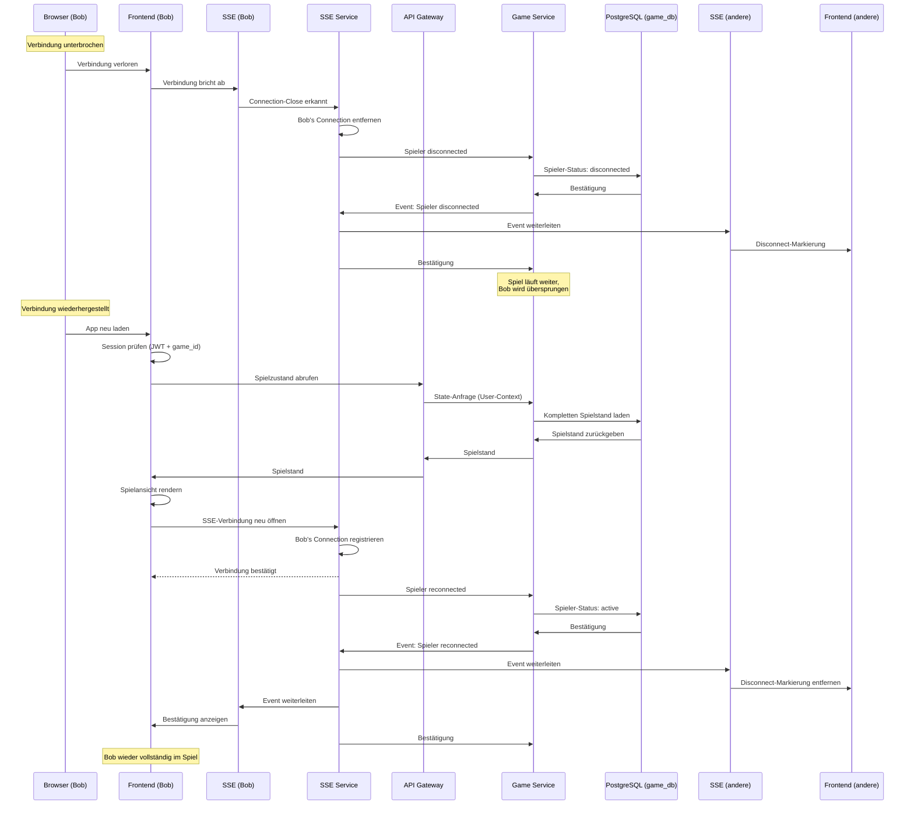
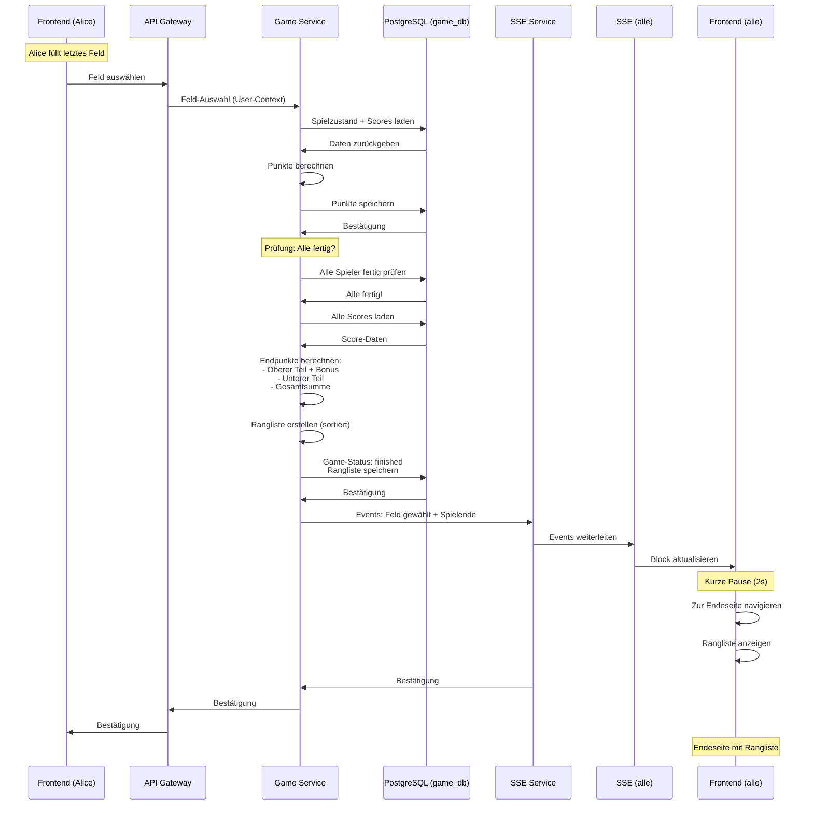
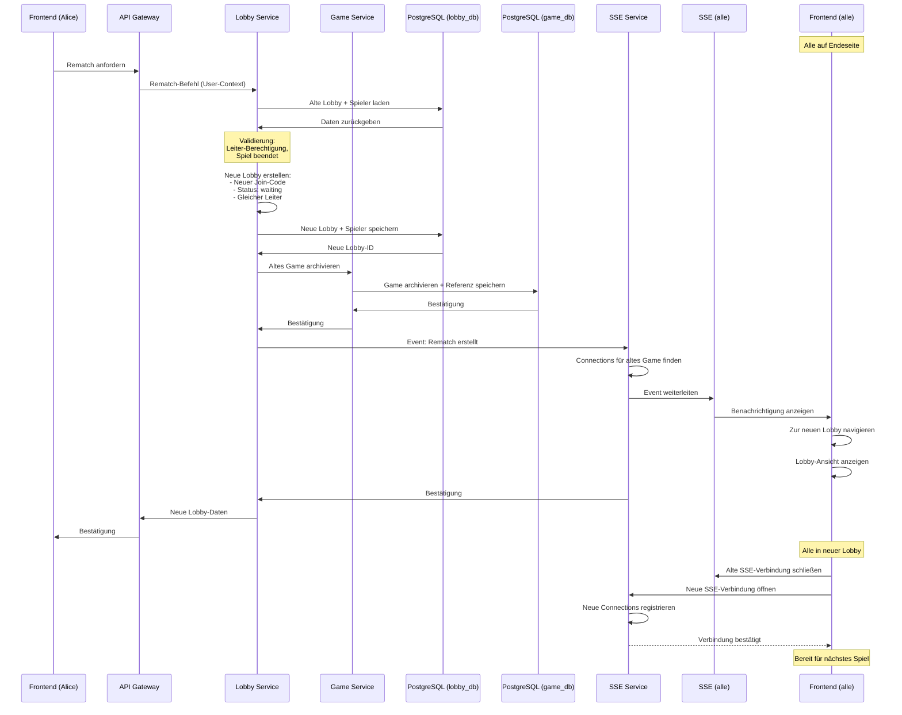
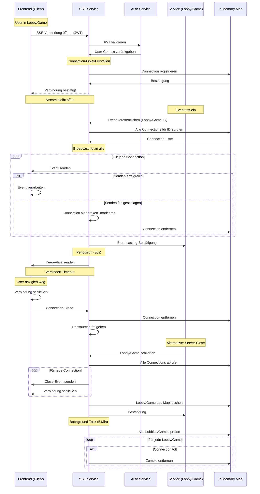

# Datenflussdiagramme: Knuffel
## Multiplayer Kniffel Web-Anwendung

**Version:** 1.0  
**Datum:** 24.10.2025  
**Status:** ✅ Finalisiert

---

## Übersicht

Dieses Dokument beschreibt die **Hauptdatenflüsse** zwischen den Services der Knuffel-Anwendung. Die Diagramme zeigen die konzeptionellen Interaktionen ohne technische Details wie REST-Pfade, Payloads oder Datenbankabfragen.

### Service-Übersicht

| Service | Verantwortlichkeit |
|---------|-------------------|
| **Frontend** | React UI, Benutzerinteraktion |
| **API Gateway** | Routing, zentrale Authentifizierung |
| **Auth Service** | JWT-Verwaltung |
| **Lobby Service** | Lobby- und Spielerverwaltung |
| **Game Service** | Spiellogik und Punkteberechnung |
| **SSE Service** | Event-Broadcasting |
| **PostgreSQL** | Datenpersistenz |

---

## Flow 1: User-Onboarding & Lobby erstellen

### Szenario
Ein neuer User öffnet die App, gibt einen Username ein und erstellt eine neue Lobby.

### Sequenzdiagramm

### Wichtige Datenflüsse
- Username → JWT-Erstellung
- Lobby-Daten → Persistierung
- Join-Code-Generierung
- SSE-Verbindung für Live-Updates

---

## Flow 2: Lobby beitreten

### Szenario
Ein zweiter User (Bob) möchte der Lobby von Alice beitreten. Er gibt seinen Username und den Join-Code ein.

### Sequenzdiagramm

### Wichtige Datenflüsse
- Join-Code → Lobby-Identifikation
- Spieler-Hinzufügen → Persistierung
- Event → Alle Lobby-Mitglieder
- Neue SSE-Verbindung

---

## Flow 3: Spiel starten

### Szenario
Alice (Lobby-Leiter) klickt auf "Spiel starten". Das System erstellt ein Game, legt die Zugreihenfolge fest und leitet alle Spieler zur Spielseite weiter.

### Sequenzdiagramm

### Wichtige Datenflüsse
- Leiter-Berechtigung → Validierung
- Zufällige Zugreihenfolge → Generierung
- Game-Initialisierung → Persistierung
- Event → Alle Spieler gleichzeitig
- Lobby-Status-Änderung (waiting → running)

---

## Flow 4: Spieler kicken

### Szenario
Alice (Lobby-Leiter) kickt Bob aus der Lobby im "waiting"-Status. Bob wird benachrichtigt und zur Startseite weitergeleitet.

### Sequenzdiagramm

### Wichtige Datenflüsse
- Kick-Berechtigung → Validierung
- Spieler-Entfernung → Persistierung
- Unterschiedliche Events für Gekickten vs. Andere
- SSE-Verbindung schließen

---

## Flow 5: Spielzug komplett

### Szenario
Charlie ist am Zug. Er würfelt dreimal, fixiert Würfel zwischen den Würfen, wählt dann ein Feld aus. Danach ist Alice an der Reihe.

### Sequenzdiagramm

### Wichtige Datenflüsse
- Würfeln: Zufallswerte → Persistierung → Broadcasting
- Fixieren: Würfel-Auswahl → Persistierung → Broadcasting
- Punkteberechnung: Würfel + Feld → Punkte
- Zugwechsel: Spieler-Index → Nächster Spieler
- Timer-Reset bei jeder Interaktion

---

## Flow 6: Timeout-Handling

### Szenario
Alice ist am Zug, interagiert aber 40 Sekunden lang nicht. Der Game Service erkennt das Timeout und überspringt Alice's Zug.

### Sequenzdiagramm

### Wichtige Datenflüsse
- Periodischer Timer → Timeout-Erkennung
- Spieler-Status: active ↔ inactive
- Automatisches Überspringen inaktiver Spieler
- Manuelle Reaktivierung möglich

---

## Flow 7: Spieler Disconnect/Reconnect

### Szenario
Bob verliert die Internetverbindung. Seine SSE-Verbindung bricht ab. Das Spiel läuft weiter. Bob stellt die Verbindung wieder her und wird automatisch zurück ins Spiel gebracht.

### Sequenzdiagramm

### Wichtige Datenflüsse
- Connection-Loss → Status-Update (disconnected)
- Spieler wird automatisch übersprungen
- Reconnect → Vollständiger Spielstand-Abruf
- Neue SSE-Verbindung aufbauen
- Status-Update (active)

---

## Flow 8: Spielende erkennen & Rangliste

### Szenario
Alice füllt ihr letztes (13.) Feld aus. Der Game Service erkennt, dass alle Spieler fertig sind, berechnet die Endpunkte und erstellt eine Rangliste.

### Sequenzdiagramm

### Wichtige Datenflüsse
- Letzte Feldwahl → Punkteberechnung
- Prüfung: Alle Spieler fertig?
- Endpunkte-Berechnung (Bonus-Logik)
- Rangliste erstellen (sortiert)
- Game-Status: running → finished
- Navigation aller Spieler zur Endeseite

---

## Flow 9: Nochmal spielen / Neue Runde

### Szenario
Die Spieler sind auf der Endeseite. Alice (Lobby-Leiter) klickt auf "Nochmal spielen". Eine neue Lobby wird mit denselben Spielern erstellt.

### Sequenzdiagramm

### Wichtige Datenflüsse
- Rematch-Berechtigung → Validierung (nur original Leiter)
- Neue Lobby-Erstellung (neuer Join-Code)
- Spieler-Übernahme (automatisch)
- Altes Game → Archivierung
- Event → Alle Spieler
- SSE-Verbindungen wechseln (alt → neu)

---

## Flow 10: SSE-Connection-Management & Event-Broadcasting

### Szenario
Technische Infrastruktur des SSE Service. Zeigt den kompletten Lifecycle: Connection aufbauen, Events empfangen, Broadcasting, Connection schließen.

### Sequenzdiagramm

### Wichtige Datenflüsse
- JWT → User-Authentifizierung
- Connection-Registrierung in Map (lobby_id/game_id → Connections)
- Event → Alle Connections parallel
- Keep-Alive → Verbindung aktiv halten
- Connection-Cleanup (Client/Server-initiiert)
- Periodischer Zombie-Cleanup

## Zusammenfassung

### Phasen-Übersicht

**Phase 1: Lobby-Management**
- Flow 1: User-Onboarding & Lobby erstellen
- Flow 2: Lobby beitreten
- Flow 3: Spiel starten
- Flow 4: Spieler kicken

**Phase 2: Spiel-Durchführung**
- Flow 5: Spielzug komplett
- Flow 6: Timeout-Handling
- Flow 7: Spieler Disconnect/Reconnect

**Phase 3: Spielende**
- Flow 8: Spielende erkennen & Rangliste
- Flow 9: Nochmal spielen / Neue Runde

**Querschnitt**
- Flow 10: SSE-Connection-Management & Event-Broadcasting

### Zentrale Datenfluss-Patterns

| Pattern | Verwendung |
|---------|------------|
| **Request → Validate → Persist → Broadcast** | Würfeln, Feldwahl, Beitreten |
| **Periodischer Check → Status-Update → Event** | Timeout-Handling |
| **Connection-Loss → Status-Update → Reconnect** | Disconnect/Reconnect |
| **Check-Complete → Calculate → Persist → Notify** | Spielende |
| **Event → Lookup-Connections → Parallel-Send** | SSE-Broadcasting |
