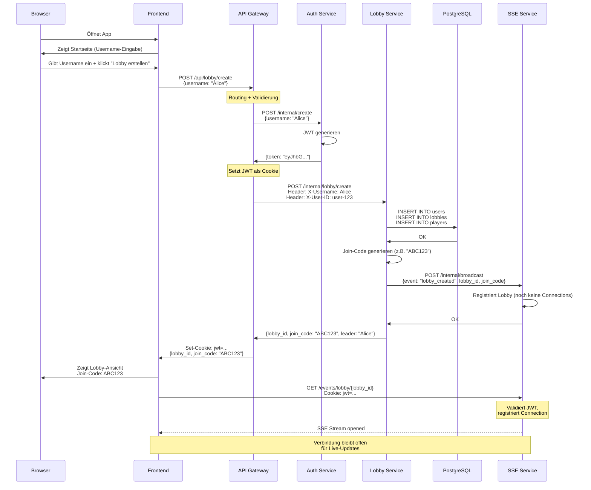
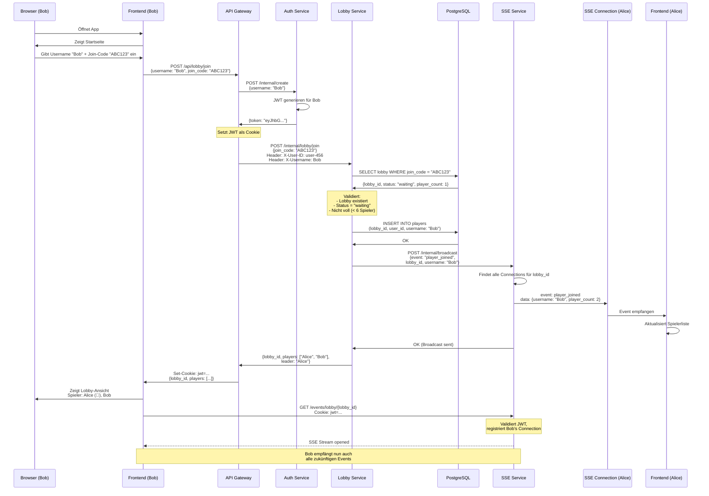
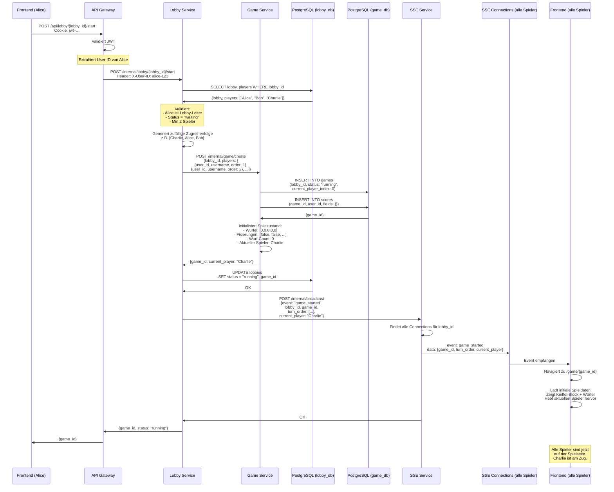
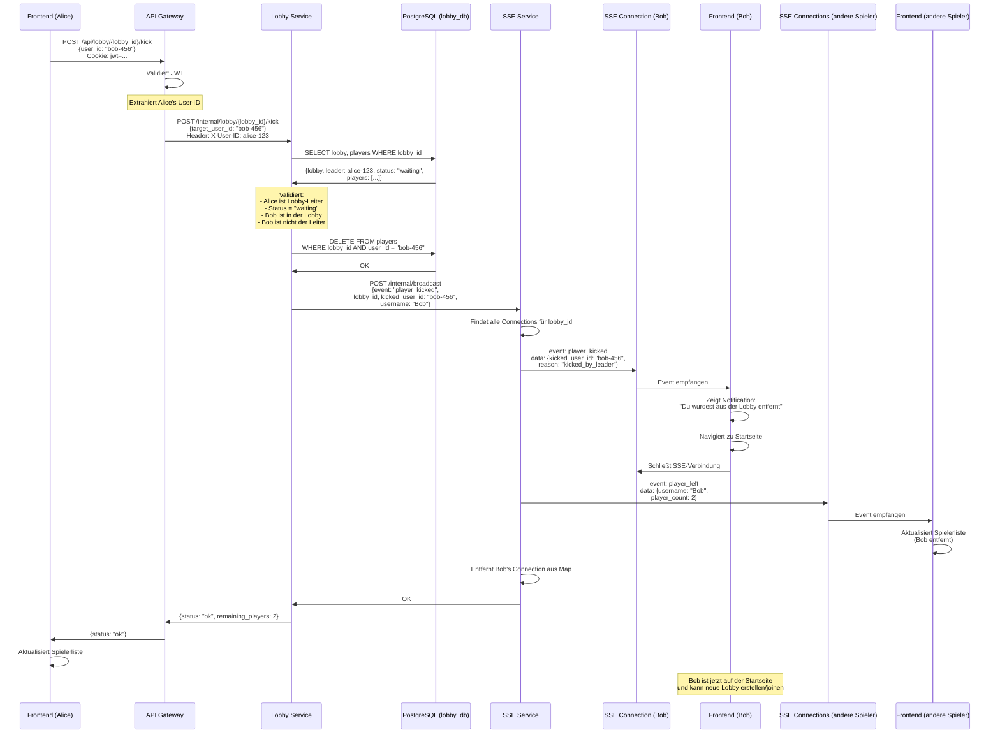
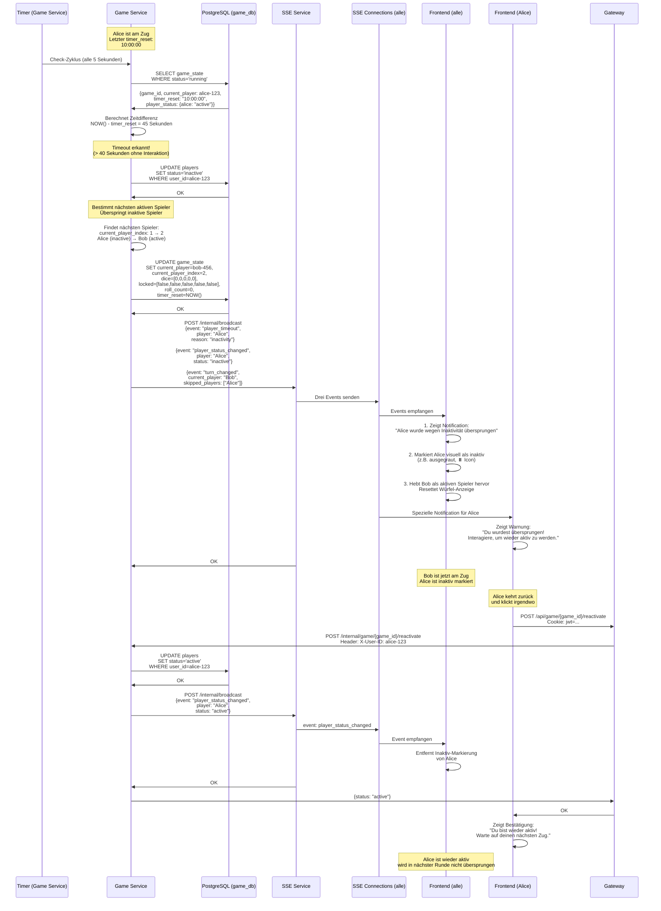
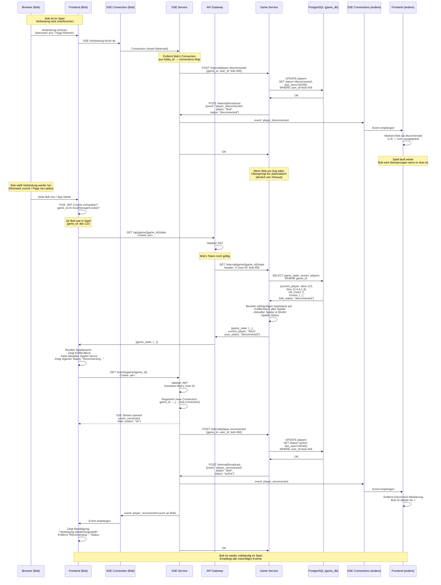
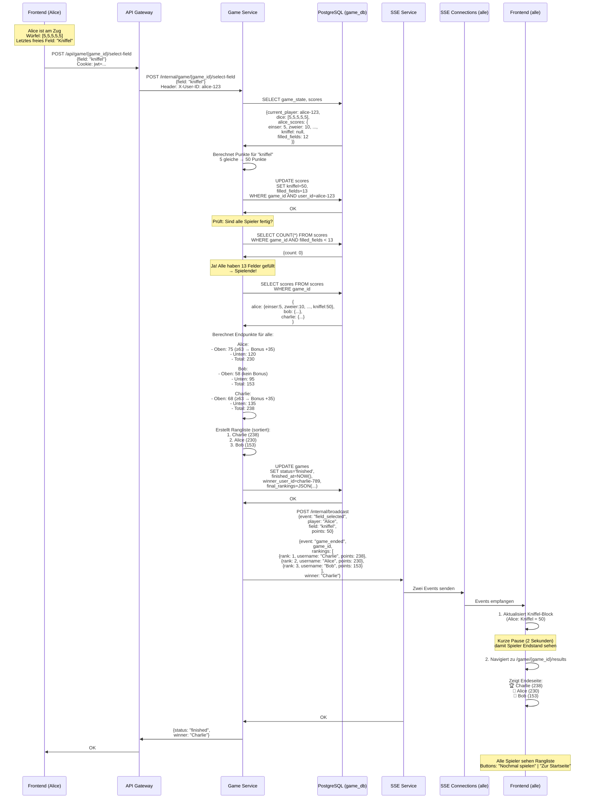
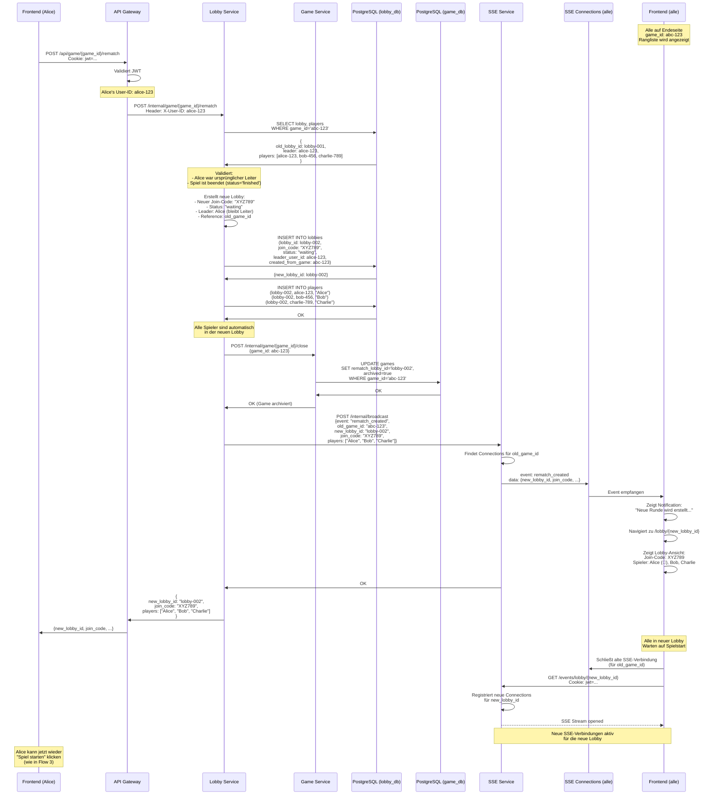

```mermaid
sequenceDiagram
    participant Frontend as Frontend (Client)
    participant SSE as SSE Service
    participant Auth as Auth Service
    participant Service as Service (Lobby/Game)
    participant Connections as In-Memory Map

    %% Connection aufbauen
    Note over Frontend: User ist in Lobby/Game<br/>lobby_id: lobby-123

    Frontend->>SSE: GET /events/lobby/lobby-123<br/>Cookie: jwt=eyJhbG...
    
    SSE->>SSE: Extrahiert JWT aus Cookie
    
    SSE->>Auth: POST /internal/validate<br/>{token: "eyJhbG..."}
    Auth->>Auth: Validiert JWT-Signatur<br/>Prüft Expiry
    Auth->>SSE: {valid: true,<br/>user_id: "alice-123",<br/>username: "Alice"}
    
    Note over SSE: JWT gültig!<br/>Erstellt SSE-Connection
    
    SSE->>SSE: Erstellt Connection-Objekt:<br/>{<br/>  connection_id: uuid(),<br/>  user_id: "alice-123",<br/>  username: "Alice",<br/>  lobby_id: "lobby-123",<br/>  opened_at: NOW(),<br/>  response_writer: w<br/>}
    
    SSE->>Connections: Map[lobby-123].add(connection)
    
    Note over Connections: In-Memory Struktur:<br/>Map[lobby_id] → []Connection<br/><br/>lobby-123 → [<br/>  {user: Alice, conn: ...},<br/>  {user: Bob, conn: ...}<br/>]
    
    Connections->>SSE: OK
    
    SSE-->>Frontend: HTTP 200 OK<br/>Content-Type: text/event-stream<br/>Cache-Control: no-cache<br/>Connection: keep-alive<br/><br/>event: connected<br/>data: {"status": "ok"}<br/><br/>
    
    Note over Frontend,SSE: SSE-Stream ist offen<br/>Verbindung bleibt bestehen

    %% Event von Service empfangen und broadcasten
    Note over Service: Ein Event tritt ein<br/>(z.B. Spieler würfelt)

    Service->>SSE: POST /internal/broadcast<br/>{<br/>  lobby_id: "lobby-123",<br/>  event_type: "dice_rolled",<br/>  data: {<br/>    player: "Bob",<br/>    dice: [3,4,6,2,1],<br/>    roll_count: 1<br/>  }<br/>}
    
    SSE->>SSE: Validiert Request<br/>(kommt von internem Service)
    
    SSE->>Connections: connections = Map[lobby-123].get()
    Connections->>SSE: [<br/>  {user: Alice, conn: ...},<br/>  {user: Bob, conn: ...},<br/>  {user: Charlie, conn: ...}<br/>]
    
    Note over SSE: Broadcasting an alle<br/>3 Connections in Lobby

    SSE->>SSE: FOR EACH connection IN connections:
    
    loop Für jede Connection
        SSE->>SSE: Formatiert SSE-Message:<br/>event: dice_rolled<br/>data: {"player":"Bob",...}<br/>id: msg-{counter}<br/><br/>
        
        SSE->>Frontend: Sendet über response_writer
        
        Note over SSE: Prüft: Senden erfolgreich?
        
        alt Connection aktiv
            Frontend->>Frontend: Event empfangen ✓
        else Connection tot
            SSE->>SSE: Markiert Connection als "broken"
            SSE->>Connections: Map[lobby-123].remove(connection)
            Note over SSE: Cleanup: Tote Connection entfernt
        end
    end
    
    SSE->>Service: HTTP 200 OK<br/>{status: "broadcasted",<br/>recipients: 3}

    Note over Frontend: Client verarbeitet Event<br/>im EventSource.onmessage

    %% Heartbeat / Keep-Alive
    Note over SSE: Periodisch (alle 30s):<br/>Keep-Alive senden

    SSE->>Frontend: :keepalive\n\n
    Note over SSE,Frontend: Verhindert Timeout,<br/>erkennt tote Connections

    %% Connection schließen (Client-initiiert)
    Note over Frontend: User navigiert weg<br/>oder schließt Browser

    Frontend->>Frontend: EventSource.close()
    
    Frontend->>SSE: HTTP Connection closed
    
    SSE->>SSE: Erkennt Connection-Close
    
    SSE->>Connections: Map[lobby-123].remove(connection)
    
    Note over Connections: Alice's Connection entfernt<br/><br/>lobby-123 → [<br/>  {user: Bob, conn: ...},<br/>  {user: Charlie, conn: ...}<br/>]
    
    SSE->>SSE: Cleanup:<br/>- Response-Writer schließen<br/>- Goroutine beenden<br/>- Memory freigeben

    %% Connection schließen (Server-initiiert)
    Note over SSE: Alternative: Server schließt<br/>(z.B. bei Spielende)

    Service->>SSE: POST /internal/close-lobby<br/>{lobby_id: "lobby-123"}
    
    SSE->>Connections: connections = Map[lobby-123].getAll()
    Connections->>SSE: [Bob, Charlie]
    
    loop Für jede Connection
        SSE->>Frontend: event: lobby_closed<br/>data: {"reason":"game_ended"}<br/><br/>
        SSE->>Frontend: HTTP Connection close
    end
    
    SSE->>Connections: Map[lobby-123].delete()
    
    Note over Connections: Gesamte Lobby<br/>aus Map entfernt
    
    SSE->>Service: OK

    %% Automatisches Cleanup
    Note over SSE: Background-Task (alle 5 Min):<br/>Aufräumen von Zombie-Connections

    SSE->>Connections: FOR EACH lobby IN Map:
    loop Für jede Lobby
        SSE->>SSE: Prüft alle Connections:<br/>- Letzter Ping > 2 Minuten?<br/>- Response-Writer tot?
        
        alt Connection tot
            SSE->>Connections: remove(connection)
            Note over SSE: Zombie entfernt
        end
    end
```

# Sequenzdiagramme

## Flow 1: User-Onboarding & Lobby erstellen

### Szenario
Ein neuer User öffnet die App, gibt einen Username ein und erstellt eine neue Lobby.

### Sequenzdiagramm



## Flow 2: Lobby beitreten

### Szenario
Ein zweiter User (Bob) möchte der Lobby von Alice beitreten. Er gibt seinen Username und den Join-Code ein.

### Sequenzdiagramm



## Flow 3: Spiel starten

### Szenario
Alice (Lobby-Leiter) klickt auf "Spiel starten". Das System erstellt ein Game, legt die Zugreihenfolge fest und leitet alle Spieler zur Spielseite weiter.

### Sequenzdiagramm



## Flow 4: Spieler kicken

### Szenario
Alice (Lobby-Leiter) kickt Bob aus der Lobby, während sich noch im "waiting"-Status befinden. Bob wird benachrichtigt und zur Startseite weitergeleitet.

### Sequenzdiagramm



## Flow 5: Spielzug komplett

### Szenario
Charlie ist am Zug. Er würfelt dreimal, fixiert Würfel zwischen den Würfen, wählt dann ein Feld aus. Danach ist Alice an der Reihe. Alle Spieler sehen die Updates in Echtzeit.

### Sequenzdiagramm



```mermaid
sequenceDiagram
    participant Frontend_Charlie as Frontend (Charlie)
    participant Gateway as API Gateway
    participant Game as Game Service
    participant DB as PostgreSQL (game_db)
    participant SSE as SSE Service
    participant SSE_All as SSE Connections (alle)
    participant Frontend_All as Frontend (alle)

    Note over Frontend_Charlie: Charlie ist am Zug<br/>Wurf-Count: 0

    %% Erster Wurf
    Frontend_Charlie->>Gateway: POST /api/game/{game_id}/roll<br/>Cookie: jwt=...
    
    Gateway->>Game: POST /internal/game/{game_id}/roll<br/>Header: X-User-ID: charlie-789
    
    Game->>DB: SELECT game_state WHERE game_id
    DB->>Game: {current_player: charlie-789,<br/>roll_count: 0, dice: [0,0,0,0,0]}
    
    Note over Game: Validiert:<br/>- Charlie ist aktueller Spieler<br/>- roll_count < 3
    
    Game->>Game: Würfelt nicht-fixierte Würfel<br/>Ergebnis: [3,3,5,2,1]
    
    Game->>DB: UPDATE game_state<br/>SET dice=[3,3,5,2,1],<br/>roll_count=1,<br/>timer_reset=NOW()
    DB->>Game: OK
    
    Game->>SSE: POST /internal/broadcast<br/>{event: "dice_rolled",<br/>game_id, player: "Charlie",<br/>dice: [3,3,5,2,1],<br/>roll_count: 1}
    
    SSE->>SSE_All: event: dice_rolled<br/>data: {...}
    SSE_All->>Frontend_All: Event empfangen
    Frontend_All->>Frontend_All: Zeigt Würfel-Animation<br/>dann Ergebnis [3,3,5,2,1]
    
    SSE->>Game: OK
    Game->>Gateway: {dice: [3,3,5,2,1], roll_count: 1}
    Gateway->>Frontend_Charlie: {dice: [...]}

    Note over Frontend_Charlie: Charlie sieht Würfel:<br/>[3,3,5,2,1]

    %% Würfel fixieren
    Frontend_Charlie->>Gateway: POST /api/game/{game_id}/toggle-dice<br/>{dice_indices: [0,1]}<br/>Cookie: jwt=...
    
    Gateway->>Game: POST /internal/game/{game_id}/toggle-dice<br/>{dice_indices: [0,1]}<br/>Header: X-User-ID: charlie-789
    
    Game->>DB: SELECT game_state
    DB->>Game: {current_player: charlie-789, ...}
    
    Note over Game: Validiert:<br/>- Charlie ist aktueller Spieler<br/>- roll_count > 0 und < 3
    
    Game->>Game: Togglet Fixierung für Index 0,1<br/>locked: [true, true, false, false, false]
    
    Game->>DB: UPDATE game_state<br/>SET locked=[true,true,false,false,false],<br/>timer_reset=NOW()
    DB->>Game: OK
    
    Game->>SSE: POST /internal/broadcast<br/>{event: "dice_locked",<br/>game_id, dice_indices: [0,1],<br/>locked: [true,true,false,false,false]}
    
    SSE->>SSE_All: event: dice_locked<br/>data: {...}
    SSE_All->>Frontend_All: Event empfangen
    Frontend_All->>Frontend_All: Zeigt Würfel 0,1 als fixiert<br/>(visueller Rahmen)
    
    SSE->>Game: OK
    Game->>Gateway: {locked: [...]}
    Gateway->>Frontend_Charlie: OK

    %% Zweiter Wurf
    Frontend_Charlie->>Gateway: POST /api/game/{game_id}/roll
    
    Gateway->>Game: POST /internal/game/{game_id}/roll<br/>Header: X-User-ID: charlie-789
    
    Game->>DB: SELECT game_state
    DB->>Game: {dice: [3,3,5,2,1],<br/>locked: [true,true,false,false,false],<br/>roll_count: 1}
    
    Game->>Game: Würfelt nur nicht-fixierte (Index 2,3,4)<br/>Neue Würfel: [3,3,6,6,3]
    
    Game->>DB: UPDATE game_state<br/>SET dice=[3,3,6,6,3],<br/>roll_count=2,<br/>timer_reset=NOW()
    DB->>Game: OK
    
    Game->>SSE: POST /internal/broadcast<br/>{event: "dice_rolled",<br/>dice: [3,3,6,6,3],<br/>roll_count: 2}
    
    SSE->>SSE_All: event: dice_rolled
    SSE_All->>Frontend_All: Aktualisiert Würfel
    
    SSE->>Game: OK
    Game->>Gateway: {dice: [3,3,6,6,3], roll_count: 2}
    Gateway->>Frontend_Charlie: OK

    Note over Frontend_Charlie: Charlie entscheidet sich,<br/>kein 3. Mal zu würfeln

    %% Feld wählen
    Frontend_Charlie->>Gateway: POST /api/game/{game_id}/select-field<br/>{field: "dreier"}<br/>Cookie: jwt=...
    
    Gateway->>Game: POST /internal/game/{game_id}/select-field<br/>{field: "dreier"}<br/>Header: X-User-ID: charlie-789
    
    Game->>DB: SELECT game_state, scores
    DB->>Game: {current_player: charlie-789,<br/>dice: [3,3,6,6,3],<br/>charlie_scores: {...}}
    
    Note over Game: Validiert:<br/>- Charlie ist aktueller Spieler<br/>- Feld "dreier" noch leer
    
    Game->>Game: Berechnet Punkte für "dreier"<br/>Würfel [3,3,6,6,3] → 9 Punkte
    
    Game->>DB: UPDATE scores<br/>SET dreier=9<br/>WHERE game_id AND user_id=charlie-789
    DB->>Game: OK
    
    Game->>Game: Nächster Spieler bestimmen<br/>current_player_index: 0 → 1<br/>Nächster: Alice
    
    Game->>DB: UPDATE game_state<br/>SET current_player=alice-123,<br/>current_player_index=1,<br/>dice=[0,0,0,0,0],<br/>locked=[false,false,false,false,false],<br/>roll_count=0,<br/>timer_reset=NOW()
    DB->>Game: OK
    
    Game->>SSE: POST /internal/broadcast<br/>{event: "field_selected",<br/>player: "Charlie",<br/>field: "dreier",<br/>points: 9}<br/><br/>{event: "turn_changed",<br/>current_player: "Alice",<br/>next_player_index: 1}
    
    SSE->>SSE_All: Zwei Events senden
    SSE_All->>Frontend_All: Events empfangen
    
    Frontend_All->>Frontend_All: 1. Aktualisiert Kniffel-Block<br/>(Charlie: Dreier = 9 Punkte)
    Frontend_All->>Frontend_All: 2. Hebt Alice als aktiven Spieler hervor<br/>Resettet Würfel-Anzeige
    
    SSE->>Game: OK
    Game->>Gateway: {status: "ok",<br/>next_player: "Alice"}
    Gateway->>Frontend_Charlie: OK

    Note over Frontend_All: Alice ist jetzt am Zug<br/>Wurf-Count: 0<br/>Würfel: [0,0,0,0,0]
```

## Flow 6: Timeout-Handling

### Szenario
Alice ist am Zug, interagiert aber 40 Sekunden lang nicht. Der Game Service erkennt das Timeout, überspringt Alice's Zug, markiert sie als "inaktiv" und gibt den Zug an Bob weiter.

### Sequenzdiagramm



## Flow 7: Spieler Disconnect/Reconnect

### Szenario
Bob verliert während des laufenden Spiels die Internetverbindung (oder macht einen Page-Refresh). Seine SSE-Verbindung bricht ab. Das Spiel läuft weiter. Bob stellt die Verbindung wieder her und wird automatisch zurück ins Spiel gebracht.

### Sequenzdiagramm



## Flow 8: Spielende erkennen & Rangliste

### Szenario
Alice füllt ihr letztes (13.) Feld aus. Der Game Service erkennt, dass alle Spieler fertig sind, berechnet die Endpunkte, erstellt eine Rangliste und leitet alle Spieler zur Endeseite weiter.

### Sequenzdiagramm



---

## Wichtige Aspekte in diesem Flow:

### **Spielende-Erkennung**
1. Nach jeder Feldwahl: **Prüfung ob Spieler fertig** (`filled_fields = 13`)
2. Wenn Spieler fertig: **Prüfung ob ALLE fertig** (`COUNT(*) WHERE filled_fields < 13`)
3. Wenn alle fertig: **Spielende-Logik triggern**

### **Endpunkte-Berechnung**
```
Oberer Teil:
  Einser + Zweier + Dreier + Vierer + Fünfer + Sechser
  WENN Summe ≥ 63 → Bonus +35

Unterer Teil:
  Dreierpasch + Viererpasch + Full House + 
  Kleine Straße + Große Straße + Kniffel + Chance

Gesamtpunktzahl:
  Oberer Teil + Bonus + Unterer Teil
```

## Flow 9: Nochmal spielen / Neue Runde

### Szenario
Die Spieler sind auf der Endeseite. Alice (ursprünglicher Lobby-Leiter) klickt auf "Nochmal spielen". Eine neue Lobby wird mit denselben Spielern erstellt, und alle werden zurück zur Lobby-Ansicht gebracht.

### Sequenzdiagramm



## Flow 10: SSE-Connection-Management & Event-Broadcasting

### Szenario
Dies ist kein User-Story-Flow, sondern zeigt die technische Infrastruktur des SSE Service. Wir zeigen den kompletten Lifecycle: Connection aufbauen, Events empfangen, Broadcasting, Connection schließen.

### Sequenzdiagramm

